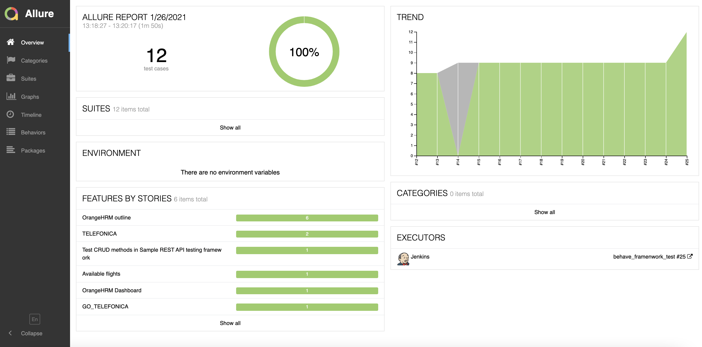
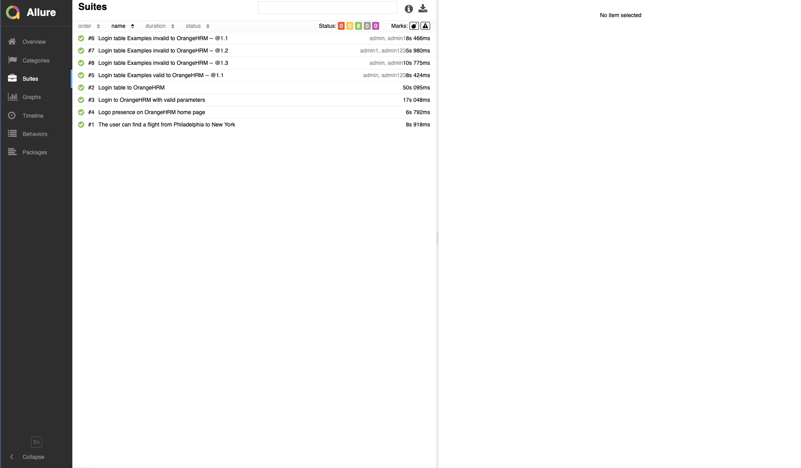
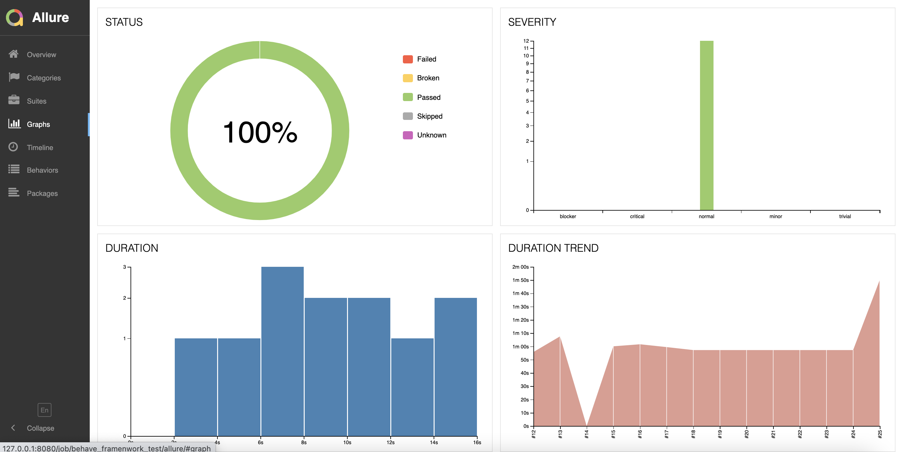
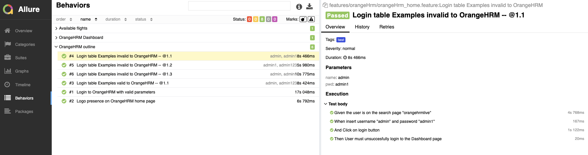

[Principal](../README.md) 

## Allure report:
Allure Framework es una herramienta de informe de prueba flexible y ligera en varios idiomas que no solo muestra una representación muy concisa de lo que se ha probado en un formulario de informe web ordenado, sino que permite a todos los que participan en el proceso de desarrollo extraer la máxima información útil de la ejecución diaria de pruebas.
Allure cuenta con un amplio espectro de posibilidades.

## Imagenes de informes con allure report:

- Ejemplo Página de resumen:

 

- Ejemplo suites:

 

- Ejemplo gráficos:

- Ejemplo comportamiento:

 

[Subir](#top)
